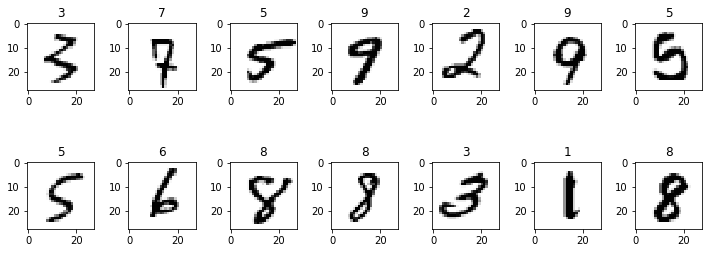
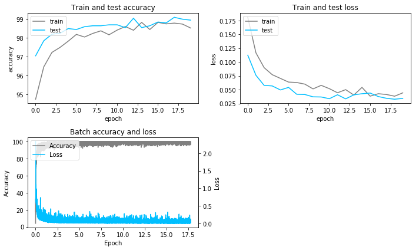
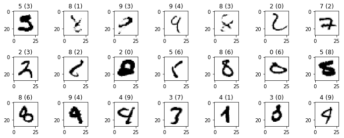

<table>
    <tr>
        <td>
            
        </td>
        <td>
    
        </td>
    </tr>
</table>

# LINCOLN DataScience Challenge #2
## CIFAR-10 - Image Recongnition

# Purpose
The goal of this notebook is to test the custom CNN implementation using the MNIST dataset.

Task done by the implementation:
- Scaling data
- Training a CNN using a softmax function / cross entropy loss
- Weight initialization : Xavier/Glorot
- Weight update using RMSprop

# Modules


```python
from scipy.misc import imread, imsave, imresize, imshow, fromimage
import matplotlib.pyplot as plt
import numpy as np

# custom CNN implementation
from convNet.conv_net import conv_net
from convNet import imfunc as imf
```

# Loading training image and label

### Image


```python
db = np.genfromtxt("MNIST/train.csv",delimiter=',',skip_header = 1)
Xtr = db[:,1:].reshape(42000,28,28,1)
```

### Label


```python
Ytr = db[:,0].astype("uint8")
```

### Plotting some image


```python
# number of image per row
n = 7
idx = np.random.choice(len(Ytr),size=n*2,replace=False)

# Initialization of plots - 2 row and n col
fig, axe = plt.subplots(2,n)

# Assigning image for each subplot
for i in range(n*2):
    axe[i//n,i%n].imshow(Xtr[idx[i]].reshape(28,28).astype("uint8"),cmap="Greys")
    axe[i//n,i%n].set_title(Ytr[idx[i]])

# Setting figure width and layout
fig.set_figwidth(10)
fig.tight_layout()
plt.show()
```





# Convolutional Neural Network - Training

### Train / test set


```python
N = 40000 # size of training set

# Training set
Y = Ytr[:N]
X = Xtr[:N,]

# Test/validation set
Y_test = Ytr[N:N+2000]
X_test = Xtr[N:N+2000,]
```

### Neural Network initialisation


```python
model = conv_net()

model.add_conv(0,1,3,64)
model.add_relu()
model.add_conv(0,1,3,64)
model.add_relu()
model.add_maxpool(2)
model.add_conv(0,1,3,32)
model.add_relu()
model.add_dropout(0.3)
model.add_conv(0,1,1,32)
model.add_relu()
model.add_dropout(0.5)
model.add_fully(10)

model.compile()
```

### Training


```python
model.train(train=(X,Y),
            test=(X_test,Y_test),
            b_size=100, # batch size
            l_rate=0.001, # learning rate
            n_epoch=20 # Epoch
            )
```

     ▄████▄   ▄▄▄       ██▀███     ▄▄▄█████▓▓█████ ▄▄▄       ███▄ ▄███▓
    ▒██▀ ▀█  ▒████▄    ▓██ ▒ ██▒   ▓  ██▒ ▓▒▓█   ▀▒████▄    ▓██▒▀█▀ ██▒
    ▒▓█    ▄ ▒██  ▀█▄  ▓██ ░▄█ ▒   ▒ ▓██░ ▒░▒███  ▒██  ▀█▄  ▓██    ▓██░
    ▒▓▓▄ ▄██▒░██▄▄▄▄██ ▒██▀▀█▄     ░ ▓██▓ ░ ▒▓█  ▄░██▄▄▄▄██ ▒██    ▒██ 
    ▒ ▓███▀ ░ ▓█   ▓██▒░██▓ ▒██▒     ▒██▒ ░ ░▒████▒▓█   ▓██▒▒██▒   ░██▒
    ░ ░▒ ▒  ░ ▒▒   ▓▒█░░ ▒▓ ░▒▓░     ▒ ░░   ░░ ▒░ ░▒▒   ▓▒█░░ ▒░   ░  ░
      ░  ▒     ▒   ▒▒ ░  ░▒ ░ ▒░       ░     ░ ░  ░ ▒   ▒▒ ░░  ░      ░
    ░          ░   ▒     ░░   ░      ░         ░    ░   ▒   ░      ░   
    ░ ░            ░  ░   ░                    ░  ░     ░  ░       ░   
    ░                                                                  
    Epoch 0 - 010/400 ░░░░░░░░░░░░░░░░░░░░ acc: 37.7 loss: 1.87747419
    Epoch 0 - 020/400 █░░░░░░░░░░░░░░░░░░░ acc: 68.6 loss: 1.021356
    Epoch 0 - 030/400 █░░░░░░░░░░░░░░░░░░░ acc: 75.7 loss: 0.77650345
    Epoch 0 - 040/400 ██░░░░░░░░░░░░░░░░░░ acc: 80.7 loss: 0.66784806
    Epoch 0 - 050/400 ██░░░░░░░░░░░░░░░░░░ acc: 83.9 loss: 0.52529754
    Epoch 0 - 060/400 ███░░░░░░░░░░░░░░░░░ acc: 84.4 loss: 0.51411453
    Epoch 0 - 070/400 ███░░░░░░░░░░░░░░░░░ acc: 87.0 loss: 0.44246288
    Epoch 0 - 080/400 ████░░░░░░░░░░░░░░░░ acc: 87.7 loss: 0.43243801
    Epoch 0 - 090/400 ████░░░░░░░░░░░░░░░░ acc: 90.3 loss: 0.36326951
    Epoch 0 - 100/400 █████░░░░░░░░░░░░░░░ acc: 88.3 loss: 0.37012242
    Epoch 0 - 110/400 █████░░░░░░░░░░░░░░░ acc: 89.3 loss: 0.36707073
    Epoch 0 - 120/400 ██████░░░░░░░░░░░░░░ acc: 89.3 loss: 0.32349664
    Epoch 0 - 130/400 ██████░░░░░░░░░░░░░░ acc: 90.4 loss: 0.29963139
    Epoch 0 - 140/400 ███████░░░░░░░░░░░░░ acc: 90.8 loss: 0.2814864
    Epoch 0 - 150/400 ███████░░░░░░░░░░░░░ acc: 91.5 loss: 0.25925537
    Epoch 0 - 160/400 ████████░░░░░░░░░░░░ acc: 91.8 loss: 0.30192159
    Epoch 0 - 170/400 ████████░░░░░░░░░░░░ acc: 91.6 loss: 0.29681183
    Epoch 0 - 180/400 █████████░░░░░░░░░░░ acc: 92.2 loss: 0.29157271
    Epoch 0 - 190/400 █████████░░░░░░░░░░░ acc: 91.0 loss: 0.28483962
    Epoch 0 - 200/400 ██████████░░░░░░░░░░ acc: 92.0 loss: 0.2313089
    Epoch 0 - 210/400 ██████████░░░░░░░░░░ acc: 92.0 loss: 0.25279295
    Epoch 0 - 220/400 ███████████░░░░░░░░░ acc: 92.3 loss: 0.25387608
    Epoch 0 - 230/400 ███████████░░░░░░░░░ acc: 92.7 loss: 0.25550266
    Epoch 0 - 240/400 ████████████░░░░░░░░ acc: 92.7 loss: 0.21960475
    Epoch 0 - 250/400 ████████████░░░░░░░░ acc: 91.7 loss: 0.27377259
    Epoch 0 - 260/400 █████████████░░░░░░░ acc: 93.0 loss: 0.23961081
    Epoch 0 - 270/400 █████████████░░░░░░░ acc: 92.9 loss: 0.21604748
    Epoch 0 - 280/400 ██████████████░░░░░░ acc: 93.8 loss: 0.23738901
    Epoch 0 - 290/400 ██████████████░░░░░░ acc: 94.4 loss: 0.16647374
    Epoch 0 - 300/400 ███████████████░░░░░ acc: 94.1 loss: 0.17977863
    Epoch 0 - 310/400 ███████████████░░░░░ acc: 93.8 loss: 0.22847369
    Epoch 0 - 320/400 ████████████████░░░░ acc: 94.8 loss: 0.14751042
    Epoch 0 - 330/400 ████████████████░░░░ acc: 95.2 loss: 0.19458855
    Epoch 0 - 340/400 █████████████████░░░ acc: 94.0 loss: 0.21036344
    Epoch 0 - 350/400 █████████████████░░░ acc: 93.6 loss: 0.20235274
    Epoch 0 - 360/400 ██████████████████░░ acc: 96.5 loss: 0.14807298
    Epoch 0 - 370/400 ██████████████████░░ acc: 94.7 loss: 0.14269058
    Epoch 0 - 380/400 ███████████████████░ acc: 95.2 loss: 0.16508111
    Epoch 0 - 390/400 ███████████████████░ acc: 94.3 loss: 0.1871529
    Epoch 0 - 400/400 ████████████████████ acc: 95.3 loss: 0.18134229
    Epoch loss: 0.180762870899
    Epoch acc: 94.74
    Test loss: 0.112330555898
    Test acc: 97.05
    Epoch 1 - 010/400 ░░░░░░░░░░░░░░░░░░░░ acc: 94.6 loss: 0.17927627
    Epoch 1 - 020/400 █░░░░░░░░░░░░░░░░░░░ acc: 95.5 loss: 0.1474255
    Epoch 1 - 030/400 █░░░░░░░░░░░░░░░░░░░ acc: 95.4 loss: 0.17012227
    Epoch 1 - 040/400 ██░░░░░░░░░░░░░░░░░░ acc: 94.6 loss: 0.14301161
    Epoch 1 - 050/400 ██░░░░░░░░░░░░░░░░░░ acc: 95.2 loss: 0.16169446
    Epoch 1 - 060/400 ███░░░░░░░░░░░░░░░░░ acc: 96.7 loss: 0.12733107
    Epoch 1 - 070/400 ███░░░░░░░░░░░░░░░░░ acc: 96.0 loss: 0.15399254
    Epoch 1 - 080/400 ████░░░░░░░░░░░░░░░░ acc: 95.4 loss: 0.15825855
    Epoch 1 - 090/400 ████░░░░░░░░░░░░░░░░ acc: 95.5 loss: 0.16515799
    Epoch 1 - 100/400 █████░░░░░░░░░░░░░░░ acc: 96.2 loss: 0.11574735
    Epoch 1 - 110/400 █████░░░░░░░░░░░░░░░ acc: 95.5 loss: 0.13647765
    Epoch 1 - 120/400 ██████░░░░░░░░░░░░░░ acc: 96.3 loss: 0.14582342
    Epoch 1 - 130/400 ██████░░░░░░░░░░░░░░ acc: 95.4 loss: 0.15760826
    Epoch 1 - 140/400 ███████░░░░░░░░░░░░░ acc: 95.5 loss: 0.15713396
    Epoch 1 - 150/400 ███████░░░░░░░░░░░░░ acc: 96.7 loss: 0.12977212
    Epoch 1 - 160/400 ████████░░░░░░░░░░░░ acc: 96.3 loss: 0.12360546
    Epoch 1 - 170/400 ████████░░░░░░░░░░░░ acc: 96.2 loss: 0.10849272
    Epoch 1 - 180/400 █████████░░░░░░░░░░░ acc: 96.3 loss: 0.11660125
    Epoch 1 - 190/400 █████████░░░░░░░░░░░ acc: 96.3 loss: 0.10936168
    Epoch 1 - 200/400 ██████████░░░░░░░░░░ acc: 96.6 loss: 0.10285228
    Epoch 1 - 210/400 ██████████░░░░░░░░░░ acc: 96.0 loss: 0.12366919
    Epoch 1 - 220/400 ███████████░░░░░░░░░ acc: 97.0 loss: 0.12065321
    Epoch 1 - 230/400 ███████████░░░░░░░░░ acc: 96.9 loss: 0.10643319
    Epoch 1 - 240/400 ████████████░░░░░░░░ acc: 96.2 loss: 0.15826608
    Epoch 1 - 250/400 ████████████░░░░░░░░ acc: 95.0 loss: 0.15064225
    Epoch 1 - 260/400 █████████████░░░░░░░ acc: 96.7 loss: 0.12329147
    Epoch 1 - 270/400 █████████████░░░░░░░ acc: 96.6 loss: 0.09062633
    Epoch 1 - 280/400 ██████████████░░░░░░ acc: 96.6 loss: 0.13067203
    Epoch 1 - 290/400 ██████████████░░░░░░ acc: 95.3 loss: 0.14369918
    Epoch 1 - 300/400 ███████████████░░░░░ acc: 94.9 loss: 0.16212686
    Epoch 1 - 310/400 ███████████████░░░░░ acc: 95.6 loss: 0.11102908
    Epoch 1 - 320/400 ████████████████░░░░ acc: 97.1 loss: 0.10915164
    Epoch 1 - 330/400 ████████████████░░░░ acc: 96.8 loss: 0.12069751
    Epoch 1 - 340/400 █████████████████░░░ acc: 96.7 loss: 0.11944505
    Epoch 1 - 350/400 █████████████████░░░ acc: 96.9 loss: 0.09662943
    Epoch 1 - 360/400 ██████████████████░░ acc: 96.2 loss: 0.10933602
    Epoch 1 - 370/400 ██████████████████░░ acc: 96.3 loss: 0.11057251
    Epoch 1 - 380/400 ███████████████████░ acc: 95.8 loss: 0.13660249
    Epoch 1 - 390/400 ███████████████████░ acc: 96.0 loss: 0.15423126
    Epoch 1 - 400/400 ████████████████████ acc: 97.2 loss: 0.0982352
    Epoch loss: 0.116593019047
    Epoch acc: 96.46
    Test loss: 0.0759924664668
    Test acc: 97.85
    Epoch 2 - 010/400 ░░░░░░░░░░░░░░░░░░░░ acc: 96.8 loss: 0.10696908
    Epoch 2 - 020/400 █░░░░░░░░░░░░░░░░░░░ acc: 96.8 loss: 0.09053928
    Epoch 2 - 030/400 █░░░░░░░░░░░░░░░░░░░ acc: 96.5 loss: 0.11607705
    Epoch 2 - 040/400 ██░░░░░░░░░░░░░░░░░░ acc: 97.3 loss: 0.08196707
    Epoch 2 - 050/400 ██░░░░░░░░░░░░░░░░░░ acc: 97.4 loss: 0.09434365
    Epoch 2 - 060/400 ███░░░░░░░░░░░░░░░░░ acc: 95.8 loss: 0.10835513
    Epoch 2 - 070/400 ███░░░░░░░░░░░░░░░░░ acc: 96.9 loss: 0.10701957
    Epoch 2 - 080/400 ████░░░░░░░░░░░░░░░░ acc: 96.7 loss: 0.09837143
    Epoch 2 - 090/400 ████░░░░░░░░░░░░░░░░ acc: 96.1 loss: 0.13061911
    Epoch 2 - 100/400 █████░░░░░░░░░░░░░░░ acc: 95.6 loss: 0.12910499
    Epoch 2 - 110/400 █████░░░░░░░░░░░░░░░ acc: 96.9 loss: 0.08594115
    Epoch 2 - 120/400 ██████░░░░░░░░░░░░░░ acc: 96.5 loss: 0.09808217
    Epoch 2 - 130/400 ██████░░░░░░░░░░░░░░ acc: 97.0 loss: 0.09875696
    Epoch 2 - 140/400 ███████░░░░░░░░░░░░░ acc: 96.6 loss: 0.1050777
    Epoch 2 - 150/400 ███████░░░░░░░░░░░░░ acc: 97.6 loss: 0.08002133
    Epoch 2 - 160/400 ████████░░░░░░░░░░░░ acc: 96.4 loss: 0.11915249
    Epoch 2 - 170/400 ████████░░░░░░░░░░░░ acc: 96.1 loss: 0.11519673
    Epoch 2 - 180/400 █████████░░░░░░░░░░░ acc: 97.4 loss: 0.08636173
    Epoch 2 - 190/400 █████████░░░░░░░░░░░ acc: 97.1 loss: 0.10854989
    Epoch 2 - 200/400 ██████████░░░░░░░░░░ acc: 97.2 loss: 0.08319919
    Epoch 2 - 210/400 ██████████░░░░░░░░░░ acc: 97.4 loss: 0.0793949
    Epoch 2 - 220/400 ███████████░░░░░░░░░ acc: 97.4 loss: 0.08523396
    Epoch 2 - 230/400 ███████████░░░░░░░░░ acc: 97.6 loss: 0.08620976
    Epoch 2 - 240/400 ████████████░░░░░░░░ acc: 96.9 loss: 0.09525578
    Epoch 2 - 250/400 ████████████░░░░░░░░ acc: 96.6 loss: 0.13304267
    Epoch 2 - 260/400 █████████████░░░░░░░ acc: 96.1 loss: 0.11537627
    Epoch 2 - 270/400 █████████████░░░░░░░ acc: 97.4 loss: 0.07911989
    Epoch 2 - 280/400 ██████████████░░░░░░ acc: 97.8 loss: 0.07974832
    Epoch 2 - 290/400 ██████████████░░░░░░ acc: 97.4 loss: 0.09125096
    Epoch 2 - 300/400 ███████████████░░░░░ acc: 97.6 loss: 0.07005098
    Epoch 2 - 310/400 ███████████████░░░░░ acc: 97.3 loss: 0.0871168
    Epoch 2 - 320/400 ████████████████░░░░ acc: 98.1 loss: 0.06286342
    Epoch 2 - 330/400 ████████████████░░░░ acc: 96.5 loss: 0.1011886
    Epoch 2 - 340/400 █████████████████░░░ acc: 96.8 loss: 0.08317185
    Epoch 2 - 350/400 █████████████████░░░ acc: 96.4 loss: 0.09743843
    Epoch 2 - 360/400 ██████████████████░░ acc: 97.1 loss: 0.11344637
    Epoch 2 - 370/400 ██████████████████░░ acc: 97.3 loss: 0.09614161
    Epoch 2 - 380/400 ███████████████████░ acc: 97.7 loss: 0.0758352
    Epoch 2 - 390/400 ███████████████████░ acc: 97.4 loss: 0.11165204
    Epoch 2 - 400/400 ████████████████████ acc: 97.7 loss: 0.069324
    Epoch loss: 0.0898178332758
    Epoch acc: 97.23
    Test loss: 0.0577887163339
    Test acc: 98.2
    Epoch 3 - 010/400 ░░░░░░░░░░░░░░░░░░░░ acc: 97.7 loss: 0.07044432
    Epoch 3 - 020/400 █░░░░░░░░░░░░░░░░░░░ acc: 96.9 loss: 0.11084478
    Epoch 3 - 030/400 █░░░░░░░░░░░░░░░░░░░ acc: 97.9 loss: 0.09122889
    Epoch 3 - 040/400 ██░░░░░░░░░░░░░░░░░░ acc: 97.7 loss: 0.06875534
    Epoch 3 - 050/400 ██░░░░░░░░░░░░░░░░░░ acc: 97.3 loss: 0.09388002
    Epoch 3 - 060/400 ███░░░░░░░░░░░░░░░░░ acc: 97.4 loss: 0.07995413
    Epoch 3 - 070/400 ███░░░░░░░░░░░░░░░░░ acc: 97.6 loss: 0.06583745
    Epoch 3 - 080/400 ████░░░░░░░░░░░░░░░░ acc: 97.5 loss: 0.09518696
    Epoch 3 - 090/400 ████░░░░░░░░░░░░░░░░ acc: 96.8 loss: 0.10840831
    Epoch 3 - 100/400 █████░░░░░░░░░░░░░░░ acc: 96.4 loss: 0.1076873
    Epoch 3 - 110/400 █████░░░░░░░░░░░░░░░ acc: 96.7 loss: 0.11931647
    Epoch 3 - 120/400 ██████░░░░░░░░░░░░░░ acc: 97.4 loss: 0.07909352
    Epoch 3 - 130/400 ██████░░░░░░░░░░░░░░ acc: 97.9 loss: 0.07960278
    Epoch 3 - 140/400 ███████░░░░░░░░░░░░░ acc: 97.3 loss: 0.07317299
    Epoch 3 - 150/400 ███████░░░░░░░░░░░░░ acc: 96.7 loss: 0.12559861
    Epoch 3 - 160/400 ████████░░░░░░░░░░░░ acc: 97.6 loss: 0.06482429
    Epoch 3 - 170/400 ████████░░░░░░░░░░░░ acc: 96.9 loss: 0.09384084
    Epoch 3 - 180/400 █████████░░░░░░░░░░░ acc: 97.1 loss: 0.0849675
    Epoch 3 - 190/400 █████████░░░░░░░░░░░ acc: 97.5 loss: 0.0842793
    Epoch 3 - 200/400 ██████████░░░░░░░░░░ acc: 97.1 loss: 0.07732206
    Epoch 3 - 210/400 ██████████░░░░░░░░░░ acc: 98.1 loss: 0.06450994
    Epoch 3 - 220/400 ███████████░░░░░░░░░ acc: 97.7 loss: 0.07247811
    Epoch 3 - 230/400 ███████████░░░░░░░░░ acc: 97.3 loss: 0.07865755
    Epoch 3 - 240/400 ████████████░░░░░░░░ acc: 97.6 loss: 0.07166831
    Epoch 3 - 250/400 ████████████░░░░░░░░ acc: 98.2 loss: 0.07561146
    Epoch 3 - 260/400 █████████████░░░░░░░ acc: 98.1 loss: 0.07615361
    Epoch 3 - 270/400 █████████████░░░░░░░ acc: 98.6 loss: 0.07347907
    Epoch 3 - 280/400 ██████████████░░░░░░ acc: 96.8 loss: 0.11781077
    Epoch 3 - 290/400 ██████████████░░░░░░ acc: 97.4 loss: 0.10115487
    Epoch 3 - 300/400 ███████████████░░░░░ acc: 98.3 loss: 0.06122209
    Epoch 3 - 310/400 ███████████████░░░░░ acc: 98.0 loss: 0.06739354
    Epoch 3 - 320/400 ████████████████░░░░ acc: 97.4 loss: 0.0821724
    Epoch 3 - 330/400 ████████████████░░░░ acc: 98.0 loss: 0.05696282
    Epoch 3 - 340/400 █████████████████░░░ acc: 97.7 loss: 0.08806278
    Epoch 3 - 350/400 █████████████████░░░ acc: 96.7 loss: 0.09569261
    Epoch 3 - 360/400 ██████████████████░░ acc: 97.3 loss: 0.08132164
    Epoch 3 - 370/400 ██████████████████░░ acc: 97.2 loss: 0.0959423
    Epoch 3 - 380/400 ███████████████████░ acc: 97.4 loss: 0.07523223
    Epoch 3 - 390/400 ███████████████████░ acc: 97.9 loss: 0.06569491
    Epoch 3 - 400/400 ████████████████████ acc: 97.4 loss: 0.06196248
    Epoch loss: 0.0770437713032
    Epoch acc: 97.5
    Test loss: 0.0567355241218
    Test acc: 98.25
    Epoch 4 - 010/400 ░░░░░░░░░░░░░░░░░░░░ acc: 97.8 loss: 0.08709601
    Epoch 4 - 020/400 █░░░░░░░░░░░░░░░░░░░ acc: 97.4 loss: 0.08403288
    Epoch 4 - 030/400 █░░░░░░░░░░░░░░░░░░░ acc: 97.9 loss: 0.07386494
    Epoch 4 - 040/400 ██░░░░░░░░░░░░░░░░░░ acc: 98.3 loss: 0.04245864
    Epoch 4 - 050/400 ██░░░░░░░░░░░░░░░░░░ acc: 98.7 loss: 0.05144024
    Epoch 4 - 060/400 ███░░░░░░░░░░░░░░░░░ acc: 97.9 loss: 0.06301469
    Epoch 4 - 070/400 ███░░░░░░░░░░░░░░░░░ acc: 96.8 loss: 0.11086976
    Epoch 4 - 080/400 ████░░░░░░░░░░░░░░░░ acc: 97.8 loss: 0.0698742
    Epoch 4 - 090/400 ████░░░░░░░░░░░░░░░░ acc: 98.1 loss: 0.06383032
    Epoch 4 - 100/400 █████░░░░░░░░░░░░░░░ acc: 97.7 loss: 0.0573174
    Epoch 4 - 110/400 █████░░░░░░░░░░░░░░░ acc: 97.4 loss: 0.07595949
    Epoch 4 - 120/400 ██████░░░░░░░░░░░░░░ acc: 97.6 loss: 0.07695339
    Epoch 4 - 130/400 ██████░░░░░░░░░░░░░░ acc: 97.9 loss: 0.06733562
    Epoch 4 - 140/400 ███████░░░░░░░░░░░░░ acc: 98.3 loss: 0.0503262
    Epoch 4 - 150/400 ███████░░░░░░░░░░░░░ acc: 97.8 loss: 0.06931894
    Epoch 4 - 160/400 ████████░░░░░░░░░░░░ acc: 97.2 loss: 0.0709748
    Epoch 4 - 170/400 ████████░░░░░░░░░░░░ acc: 97.6 loss: 0.08705829
    Epoch 4 - 180/400 █████████░░░░░░░░░░░ acc: 97.9 loss: 0.05957767
    Epoch 4 - 190/400 █████████░░░░░░░░░░░ acc: 97.4 loss: 0.09093193
    Epoch 4 - 200/400 ██████████░░░░░░░░░░ acc: 96.8 loss: 0.0952438
    Epoch 4 - 210/400 ██████████░░░░░░░░░░ acc: 97.1 loss: 0.08457981
    Epoch 4 - 220/400 ███████████░░░░░░░░░ acc: 97.6 loss: 0.06789402
    Epoch 4 - 230/400 ███████████░░░░░░░░░ acc: 97.4 loss: 0.10281799
    Epoch 4 - 240/400 ████████████░░░░░░░░ acc: 97.7 loss: 0.06745399
    Epoch 4 - 250/400 ████████████░░░░░░░░ acc: 97.8 loss: 0.07398824
    Epoch 4 - 260/400 █████████████░░░░░░░ acc: 97.7 loss: 0.06555118
    Epoch 4 - 270/400 █████████████░░░░░░░ acc: 97.6 loss: 0.06432431
    Epoch 4 - 280/400 ██████████████░░░░░░ acc: 97.9 loss: 0.07010953
    Epoch 4 - 290/400 ██████████████░░░░░░ acc: 98.0 loss: 0.07194368
    Epoch 4 - 300/400 ███████████████░░░░░ acc: 97.3 loss: 0.10681562
    Epoch 4 - 310/400 ███████████████░░░░░ acc: 98.1 loss: 0.0655268
    Epoch 4 - 320/400 ████████████████░░░░ acc: 97.8 loss: 0.07951599
    Epoch 4 - 330/400 ████████████████░░░░ acc: 97.2 loss: 0.09136534
    Epoch 4 - 340/400 █████████████████░░░ acc: 98.2 loss: 0.05728721
    Epoch 4 - 350/400 █████████████████░░░ acc: 98.0 loss: 0.06557822
    Epoch 4 - 360/400 ██████████████████░░ acc: 97.1 loss: 0.08116337
    Epoch 4 - 370/400 ██████████████████░░ acc: 98.7 loss: 0.03894008
    Epoch 4 - 380/400 ███████████████████░ acc: 98.5 loss: 0.04392789
    Epoch 4 - 390/400 ███████████████████░ acc: 97.2 loss: 0.10748169
    Epoch 4 - 400/400 ████████████████████ acc: 97.5 loss: 0.07284801
    Epoch loss: 0.0703634612132
    Epoch acc: 97.83
    Test loss: 0.0494547461965
    Test acc: 98.5
    Epoch 5 - 010/400 ░░░░░░░░░░░░░░░░░░░░ acc: 97.7 loss: 0.08208643
    Epoch 5 - 020/400 █░░░░░░░░░░░░░░░░░░░ acc: 98.5 loss: 0.04364327
    Epoch 5 - 030/400 █░░░░░░░░░░░░░░░░░░░ acc: 98.4 loss: 0.06108903
    Epoch 5 - 040/400 ██░░░░░░░░░░░░░░░░░░ acc: 97.6 loss: 0.08742435
    Epoch 5 - 050/400 ██░░░░░░░░░░░░░░░░░░ acc: 97.1 loss: 0.08390976
    Epoch 5 - 060/400 ███░░░░░░░░░░░░░░░░░ acc: 97.4 loss: 0.06997313
    Epoch 5 - 070/400 ███░░░░░░░░░░░░░░░░░ acc: 98.4 loss: 0.06041869
    Epoch 5 - 080/400 ████░░░░░░░░░░░░░░░░ acc: 97.7 loss: 0.07293282
    Epoch 5 - 090/400 ████░░░░░░░░░░░░░░░░ acc: 97.6 loss: 0.07759922
    Epoch 5 - 100/400 █████░░░░░░░░░░░░░░░ acc: 98.2 loss: 0.06752745
    Epoch 5 - 110/400 █████░░░░░░░░░░░░░░░ acc: 97.6 loss: 0.08028237
    Epoch 5 - 120/400 ██████░░░░░░░░░░░░░░ acc: 97.3 loss: 0.08613161
    Epoch 5 - 130/400 ██████░░░░░░░░░░░░░░ acc: 97.6 loss: 0.06740419
    Epoch 5 - 140/400 ███████░░░░░░░░░░░░░ acc: 97.6 loss: 0.06527776
    Epoch 5 - 150/400 ███████░░░░░░░░░░░░░ acc: 98.5 loss: 0.06008614
    Epoch 5 - 160/400 ████████░░░░░░░░░░░░ acc: 98.2 loss: 0.04913097
    Epoch 5 - 170/400 ████████░░░░░░░░░░░░ acc: 97.5 loss: 0.07379069
    Epoch 5 - 180/400 █████████░░░░░░░░░░░ acc: 97.8 loss: 0.06170143
    Epoch 5 - 190/400 █████████░░░░░░░░░░░ acc: 97.3 loss: 0.07641859
    Epoch 5 - 200/400 ██████████░░░░░░░░░░ acc: 98.0 loss: 0.06545052
    Epoch 5 - 210/400 ██████████░░░░░░░░░░ acc: 97.8 loss: 0.07220214
    Epoch 5 - 220/400 ███████████░░░░░░░░░ acc: 97.7 loss: 0.04834521
    Epoch 5 - 230/400 ███████████░░░░░░░░░ acc: 97.7 loss: 0.05258776
    Epoch 5 - 240/400 ████████████░░░░░░░░ acc: 97.7 loss: 0.07791939
    Epoch 5 - 250/400 ████████████░░░░░░░░ acc: 98.7 loss: 0.05794485
    Epoch 5 - 260/400 █████████████░░░░░░░ acc: 97.6 loss: 0.06745771
    Epoch 5 - 270/400 █████████████░░░░░░░ acc: 98.3 loss: 0.06862348
    Epoch 5 - 280/400 ██████████████░░░░░░ acc: 98.2 loss: 0.06294557
    Epoch 5 - 290/400 ██████████████░░░░░░ acc: 97.9 loss: 0.07503456
    Epoch 5 - 300/400 ███████████████░░░░░ acc: 98.2 loss: 0.08066506
    Epoch 5 - 310/400 ███████████████░░░░░ acc: 98.7 loss: 0.06297181
    Epoch 5 - 320/400 ████████████████░░░░ acc: 97.7 loss: 0.06853175
    Epoch 5 - 330/400 ████████████████░░░░ acc: 97.9 loss: 0.06533179
    Epoch 5 - 340/400 █████████████████░░░ acc: 98.3 loss: 0.05442029
    Epoch 5 - 350/400 █████████████████░░░ acc: 98.1 loss: 0.06832923
    Epoch 5 - 360/400 ██████████████████░░ acc: 97.6 loss: 0.07804323
    Epoch 5 - 370/400 ██████████████████░░ acc: 98.7 loss: 0.05159999
    Epoch 5 - 380/400 ███████████████████░ acc: 98.0 loss: 0.07997224
    Epoch 5 - 390/400 ███████████████████░ acc: 97.9 loss: 0.06986912
    Epoch 5 - 400/400 ████████████████████ acc: 99.0 loss: 0.03767048
    Epoch loss: 0.0636739934956
    Epoch acc: 98.19
    Test loss: 0.0540972094234
    Test acc: 98.45
    Epoch 6 - 010/400 ░░░░░░░░░░░░░░░░░░░░ acc: 97.9 loss: 0.06275592
    Epoch 6 - 020/400 █░░░░░░░░░░░░░░░░░░░ acc: 98.5 loss: 0.04711349
    Epoch 6 - 030/400 █░░░░░░░░░░░░░░░░░░░ acc: 97.6 loss: 0.06886432
    Epoch 6 - 040/400 ██░░░░░░░░░░░░░░░░░░ acc: 98.1 loss: 0.06349635
    Epoch 6 - 050/400 ██░░░░░░░░░░░░░░░░░░ acc: 97.0 loss: 0.09075076
    Epoch 6 - 060/400 ███░░░░░░░░░░░░░░░░░ acc: 97.9 loss: 0.08395749
    Epoch 6 - 070/400 ███░░░░░░░░░░░░░░░░░ acc: 98.3 loss: 0.05091401
    Epoch 6 - 080/400 ████░░░░░░░░░░░░░░░░ acc: 98.0 loss: 0.05558729
    Epoch 6 - 090/400 ████░░░░░░░░░░░░░░░░ acc: 97.9 loss: 0.05924291
    Epoch 6 - 100/400 █████░░░░░░░░░░░░░░░ acc: 98.5 loss: 0.05520301
    Epoch 6 - 110/400 █████░░░░░░░░░░░░░░░ acc: 98.3 loss: 0.0416355
    Epoch 6 - 120/400 ██████░░░░░░░░░░░░░░ acc: 98.1 loss: 0.05166324
    Epoch 6 - 130/400 ██████░░░░░░░░░░░░░░ acc: 97.8 loss: 0.07221821
    Epoch 6 - 140/400 ███████░░░░░░░░░░░░░ acc: 97.6 loss: 0.05950669
    Epoch 6 - 150/400 ███████░░░░░░░░░░░░░ acc: 98.6 loss: 0.04599236
    Epoch 6 - 160/400 ████████░░░░░░░░░░░░ acc: 97.6 loss: 0.08253489
    Epoch 6 - 170/400 ████████░░░░░░░░░░░░ acc: 98.0 loss: 0.06247226
    Epoch 6 - 180/400 █████████░░░░░░░░░░░ acc: 98.6 loss: 0.04091144
    Epoch 6 - 190/400 █████████░░░░░░░░░░░ acc: 97.5 loss: 0.0694021
    Epoch 6 - 200/400 ██████████░░░░░░░░░░ acc: 98.4 loss: 0.04558534
    Epoch 6 - 210/400 ██████████░░░░░░░░░░ acc: 98.2 loss: 0.06833512
    Epoch 6 - 220/400 ███████████░░░░░░░░░ acc: 98.0 loss: 0.07137781
    Epoch 6 - 230/400 ███████████░░░░░░░░░ acc: 98.3 loss: 0.07346735
    Epoch 6 - 240/400 ████████████░░░░░░░░ acc: 98.3 loss: 0.0571168
    Epoch 6 - 250/400 ████████████░░░░░░░░ acc: 97.6 loss: 0.07623138
    Epoch 6 - 260/400 █████████████░░░░░░░ acc: 98.9 loss: 0.04527318
    Epoch 6 - 270/400 █████████████░░░░░░░ acc: 98.2 loss: 0.04499527
    Epoch 6 - 280/400 ██████████████░░░░░░ acc: 98.3 loss: 0.04832909
    Epoch 6 - 290/400 ██████████████░░░░░░ acc: 98.3 loss: 0.06081829
    Epoch 6 - 300/400 ███████████████░░░░░ acc: 97.8 loss: 0.07253116
    Epoch 6 - 310/400 ███████████████░░░░░ acc: 98.7 loss: 0.05547441
    Epoch 6 - 320/400 ████████████████░░░░ acc: 98.4 loss: 0.05752812
    Epoch 6 - 330/400 ████████████████░░░░ acc: 97.8 loss: 0.06281033
    Epoch 6 - 340/400 █████████████████░░░ acc: 97.6 loss: 0.06046603
    Epoch 6 - 350/400 █████████████████░░░ acc: 98.1 loss: 0.05413957
    Epoch 6 - 360/400 ██████████████████░░ acc: 97.3 loss: 0.07733838
    Epoch 6 - 370/400 ██████████████████░░ acc: 97.9 loss: 0.05343071
    Epoch 6 - 380/400 ███████████████████░ acc: 98.4 loss: 0.04554416
    Epoch 6 - 390/400 ███████████████████░ acc: 98.1 loss: 0.08334695
    Epoch 6 - 400/400 ████████████████████ acc: 98.2 loss: 0.07911246
    Epoch loss: 0.0629191122137
    Epoch acc: 98.05
    Test loss: 0.0416585435953
    Test acc: 98.6
    Epoch 7 - 010/400 ░░░░░░░░░░░░░░░░░░░░ acc: 98.7 loss: 0.03634612
    Epoch 7 - 020/400 █░░░░░░░░░░░░░░░░░░░ acc: 98.3 loss: 0.05355455
    Epoch 7 - 030/400 █░░░░░░░░░░░░░░░░░░░ acc: 98.1 loss: 0.05425091
    Epoch 7 - 040/400 ██░░░░░░░░░░░░░░░░░░ acc: 98.4 loss: 0.04042794
    Epoch 7 - 050/400 ██░░░░░░░░░░░░░░░░░░ acc: 97.5 loss: 0.0747524
    Epoch 7 - 060/400 ███░░░░░░░░░░░░░░░░░ acc: 97.8 loss: 0.08764544
    Epoch 7 - 070/400 ███░░░░░░░░░░░░░░░░░ acc: 98.5 loss: 0.06257454
    Epoch 7 - 080/400 ████░░░░░░░░░░░░░░░░ acc: 97.9 loss: 0.06067245
    Epoch 7 - 090/400 ████░░░░░░░░░░░░░░░░ acc: 97.8 loss: 0.07839536
    Epoch 7 - 100/400 █████░░░░░░░░░░░░░░░ acc: 97.7 loss: 0.06030225
    Epoch 7 - 110/400 █████░░░░░░░░░░░░░░░ acc: 98.4 loss: 0.04754299
    Epoch 7 - 120/400 ██████░░░░░░░░░░░░░░ acc: 97.8 loss: 0.06689222
    Epoch 7 - 130/400 ██████░░░░░░░░░░░░░░ acc: 97.7 loss: 0.0528582
    Epoch 7 - 140/400 ███████░░░░░░░░░░░░░ acc: 98.4 loss: 0.0535245
    Epoch 7 - 150/400 ███████░░░░░░░░░░░░░ acc: 98.4 loss: 0.04392698
    Epoch 7 - 160/400 ████████░░░░░░░░░░░░ acc: 98.7 loss: 0.0420054
    Epoch 7 - 170/400 ████████░░░░░░░░░░░░ acc: 97.3 loss: 0.07969312
    Epoch 7 - 180/400 █████████░░░░░░░░░░░ acc: 97.2 loss: 0.09087815
    Epoch 7 - 190/400 █████████░░░░░░░░░░░ acc: 98.6 loss: 0.04797908
    Epoch 7 - 200/400 ██████████░░░░░░░░░░ acc: 98.4 loss: 0.04939288
    Epoch 7 - 210/400 ██████████░░░░░░░░░░ acc: 97.8 loss: 0.06042674
    Epoch 7 - 220/400 ███████████░░░░░░░░░ acc: 98.5 loss: 0.05544069
    Epoch 7 - 230/400 ███████████░░░░░░░░░ acc: 98.5 loss: 0.06855971
    Epoch 7 - 240/400 ████████████░░░░░░░░ acc: 97.9 loss: 0.0608697
    Epoch 7 - 250/400 ████████████░░░░░░░░ acc: 98.9 loss: 0.0341894
    Epoch 7 - 260/400 █████████████░░░░░░░ acc: 98.6 loss: 0.04191253
    Epoch 7 - 270/400 █████████████░░░░░░░ acc: 98.5 loss: 0.05206975
    Epoch 7 - 280/400 ██████████████░░░░░░ acc: 97.8 loss: 0.05423129
    Epoch 7 - 290/400 ██████████████░░░░░░ acc: 98.5 loss: 0.04123267
    Epoch 7 - 300/400 ███████████████░░░░░ acc: 98.6 loss: 0.05335122
    Epoch 7 - 310/400 ███████████████░░░░░ acc: 98.4 loss: 0.05099404
    Epoch 7 - 320/400 ████████████████░░░░ acc: 98.5 loss: 0.04793818
    Epoch 7 - 330/400 ████████████████░░░░ acc: 97.6 loss: 0.07668574
    Epoch 7 - 340/400 █████████████████░░░ acc: 99.0 loss: 0.05218368
    Epoch 7 - 350/400 █████████████████░░░ acc: 97.8 loss: 0.07388895
    Epoch 7 - 360/400 ██████████████████░░ acc: 98.3 loss: 0.06273828
    Epoch 7 - 370/400 ██████████████████░░ acc: 98.5 loss: 0.05187615
    Epoch 7 - 380/400 ███████████████████░ acc: 98.0 loss: 0.05609572
    Epoch 7 - 390/400 ███████████████████░ acc: 98.2 loss: 0.0677076
    Epoch 7 - 400/400 ████████████████████ acc: 98.1 loss: 0.05946764
    Epoch loss: 0.059957598864
    Epoch acc: 98.24
    Test loss: 0.0412494929214
    Test acc: 98.65
    Epoch 8 - 010/400 ░░░░░░░░░░░░░░░░░░░░ acc: 98.1 loss: 0.06227188
    Epoch 8 - 020/400 █░░░░░░░░░░░░░░░░░░░ acc: 97.6 loss: 0.0743701
    Epoch 8 - 030/400 █░░░░░░░░░░░░░░░░░░░ acc: 97.4 loss: 0.08204608
    Epoch 8 - 040/400 ██░░░░░░░░░░░░░░░░░░ acc: 98.2 loss: 0.05904498
    Epoch 8 - 050/400 ██░░░░░░░░░░░░░░░░░░ acc: 99.2 loss: 0.02981163
    Epoch 8 - 060/400 ███░░░░░░░░░░░░░░░░░ acc: 98.8 loss: 0.04019016
    Epoch 8 - 070/400 ███░░░░░░░░░░░░░░░░░ acc: 98.6 loss: 0.04189828
    Epoch 8 - 080/400 ████░░░░░░░░░░░░░░░░ acc: 98.8 loss: 0.05069933
    Epoch 8 - 090/400 ████░░░░░░░░░░░░░░░░ acc: 97.9 loss: 0.05501271
    Epoch 8 - 100/400 █████░░░░░░░░░░░░░░░ acc: 98.1 loss: 0.06085973
    Epoch 8 - 110/400 █████░░░░░░░░░░░░░░░ acc: 98.4 loss: 0.04093873
    Epoch 8 - 120/400 ██████░░░░░░░░░░░░░░ acc: 98.5 loss: 0.04104405
    Epoch 8 - 130/400 ██████░░░░░░░░░░░░░░ acc: 98.2 loss: 0.05620302
    Epoch 8 - 140/400 ███████░░░░░░░░░░░░░ acc: 98.3 loss: 0.05834074
    Epoch 8 - 150/400 ███████░░░░░░░░░░░░░ acc: 98.2 loss: 0.06408147
    Epoch 8 - 160/400 ████████░░░░░░░░░░░░ acc: 98.0 loss: 0.06919996
    Epoch 8 - 170/400 ████████░░░░░░░░░░░░ acc: 98.5 loss: 0.03926565
    Epoch 8 - 180/400 █████████░░░░░░░░░░░ acc: 98.3 loss: 0.05475605
    Epoch 8 - 190/400 █████████░░░░░░░░░░░ acc: 98.2 loss: 0.05807444
    Epoch 8 - 200/400 ██████████░░░░░░░░░░ acc: 98.5 loss: 0.05053582
    Epoch 8 - 210/400 ██████████░░░░░░░░░░ acc: 98.7 loss: 0.05503126
    Epoch 8 - 220/400 ███████████░░░░░░░░░ acc: 98.5 loss: 0.05738968
    Epoch 8 - 230/400 ███████████░░░░░░░░░ acc: 98.1 loss: 0.06119908
    Epoch 8 - 240/400 ████████████░░░░░░░░ acc: 98.0 loss: 0.05721544
    Epoch 8 - 250/400 ████████████░░░░░░░░ acc: 98.4 loss: 0.03939565
    Epoch 8 - 260/400 █████████████░░░░░░░ acc: 98.0 loss: 0.06708303
    Epoch 8 - 270/400 █████████████░░░░░░░ acc: 98.5 loss: 0.04510571
    Epoch 8 - 280/400 ██████████████░░░░░░ acc: 98.6 loss: 0.04199865
    Epoch 8 - 290/400 ██████████████░░░░░░ acc: 97.7 loss: 0.07711269
    Epoch 8 - 300/400 ███████████████░░░░░ acc: 98.3 loss: 0.06305269
    Epoch 8 - 310/400 ███████████████░░░░░ acc: 98.2 loss: 0.04795636
    Epoch 8 - 320/400 ████████████████░░░░ acc: 98.2 loss: 0.05324265
    Epoch 8 - 330/400 ████████████████░░░░ acc: 97.3 loss: 0.07315062
    Epoch 8 - 340/400 █████████████████░░░ acc: 98.3 loss: 0.04948711
    Epoch 8 - 350/400 █████████████████░░░ acc: 98.4 loss: 0.04290138
    Epoch 8 - 360/400 ██████████████████░░ acc: 98.5 loss: 0.05102573
    Epoch 8 - 370/400 ██████████████████░░ acc: 98.4 loss: 0.06564845
    Epoch 8 - 380/400 ███████████████████░ acc: 98.4 loss: 0.05323111
    Epoch 8 - 390/400 ███████████████████░ acc: 99.0 loss: 0.04514148
    Epoch 8 - 400/400 ████████████████████ acc: 99.1 loss: 0.03206201
    Epoch loss: 0.0513846906538
    Epoch acc: 98.38
    Test loss: 0.0370245682291
    Test acc: 98.65
    Epoch 9 - 010/400 ░░░░░░░░░░░░░░░░░░░░ acc: 98.6 loss: 0.04365988
    Epoch 9 - 020/400 █░░░░░░░░░░░░░░░░░░░ acc: 98.3 loss: 0.05892125
    Epoch 9 - 030/400 █░░░░░░░░░░░░░░░░░░░ acc: 98.7 loss: 0.03366881
    Epoch 9 - 040/400 ██░░░░░░░░░░░░░░░░░░ acc: 98.6 loss: 0.03151703
    Epoch 9 - 050/400 ██░░░░░░░░░░░░░░░░░░ acc: 98.1 loss: 0.06709484
    Epoch 9 - 060/400 ███░░░░░░░░░░░░░░░░░ acc: 98.9 loss: 0.03924631
    Epoch 9 - 070/400 ███░░░░░░░░░░░░░░░░░ acc: 98.6 loss: 0.04301626
    Epoch 9 - 080/400 ████░░░░░░░░░░░░░░░░ acc: 98.4 loss: 0.046873
    Epoch 9 - 090/400 ████░░░░░░░░░░░░░░░░ acc: 98.4 loss: 0.04641166
    Epoch 9 - 100/400 █████░░░░░░░░░░░░░░░ acc: 98.9 loss: 0.05719172
    Epoch 9 - 110/400 █████░░░░░░░░░░░░░░░ acc: 98.8 loss: 0.03682192
    Epoch 9 - 120/400 ██████░░░░░░░░░░░░░░ acc: 98.5 loss: 0.04978916
    Epoch 9 - 130/400 ██████░░░░░░░░░░░░░░ acc: 99.0 loss: 0.03128839
    Epoch 9 - 140/400 ███████░░░░░░░░░░░░░ acc: 98.9 loss: 0.03316635
    Epoch 9 - 150/400 ███████░░░░░░░░░░░░░ acc: 97.9 loss: 0.0644618
    Epoch 9 - 160/400 ████████░░░░░░░░░░░░ acc: 98.7 loss: 0.03692747
    Epoch 9 - 170/400 ████████░░░░░░░░░░░░ acc: 98.5 loss: 0.0422078
    Epoch 9 - 180/400 █████████░░░░░░░░░░░ acc: 98.7 loss: 0.07641915
    Epoch 9 - 190/400 █████████░░░░░░░░░░░ acc: 98.6 loss: 0.04228446
    Epoch 9 - 200/400 ██████████░░░░░░░░░░ acc: 97.8 loss: 0.05567016
    Epoch 9 - 210/400 ██████████░░░░░░░░░░ acc: 98.5 loss: 0.04453869
    Epoch 9 - 220/400 ███████████░░░░░░░░░ acc: 98.4 loss: 0.0408419
    Epoch 9 - 230/400 ███████████░░░░░░░░░ acc: 97.8 loss: 0.05576241
    Epoch 9 - 240/400 ████████████░░░░░░░░ acc: 98.4 loss: 0.03674934
    Epoch 9 - 250/400 ████████████░░░░░░░░ acc: 98.0 loss: 0.06141392
    Epoch 9 - 260/400 █████████████░░░░░░░ acc: 98.4 loss: 0.05467885
    Epoch 9 - 270/400 █████████████░░░░░░░ acc: 97.9 loss: 0.07247694
    Epoch 9 - 280/400 ██████████████░░░░░░ acc: 98.1 loss: 0.04943201
    Epoch 9 - 290/400 ██████████████░░░░░░ acc: 97.6 loss: 0.10968294
    Epoch 9 - 300/400 ███████████████░░░░░ acc: 98.8 loss: 0.0397392
    Epoch 9 - 310/400 ███████████████░░░░░ acc: 98.6 loss: 0.04263558
    Epoch 9 - 320/400 ████████████████░░░░ acc: 98.1 loss: 0.06056187
    Epoch 9 - 330/400 ████████████████░░░░ acc: 98.5 loss: 0.03932246
    Epoch 9 - 340/400 █████████████████░░░ acc: 99.1 loss: 0.03476969
    Epoch 9 - 350/400 █████████████████░░░ acc: 97.2 loss: 0.07353306
    Epoch 9 - 360/400 ██████████████████░░ acc: 98.4 loss: 0.04202896
    Epoch 9 - 370/400 ██████████████████░░ acc: 97.7 loss: 0.06566512
    Epoch 9 - 380/400 ███████████████████░ acc: 98.0 loss: 0.06296229
    Epoch 9 - 390/400 ███████████████████░ acc: 97.8 loss: 0.08655657
    Epoch 9 - 400/400 ████████████████████ acc: 98.3 loss: 0.06982117
    Epoch loss: 0.0577856786162
    Epoch acc: 98.17
    Test loss: 0.0367587067667
    Test acc: 98.7
    Epoch 10 - 010/400 ░░░░░░░░░░░░░░░░░░░░ acc: 98.0 loss: 0.05786645
    Epoch 10 - 020/400 █░░░░░░░░░░░░░░░░░░░ acc: 98.3 loss: 0.06512833
    Epoch 10 - 030/400 █░░░░░░░░░░░░░░░░░░░ acc: 98.4 loss: 0.03718341
    Epoch 10 - 040/400 ██░░░░░░░░░░░░░░░░░░ acc: 98.2 loss: 0.04432566
    Epoch 10 - 050/400 ██░░░░░░░░░░░░░░░░░░ acc: 98.1 loss: 0.06209723
    Epoch 10 - 060/400 ███░░░░░░░░░░░░░░░░░ acc: 98.4 loss: 0.04340918
    Epoch 10 - 070/400 ███░░░░░░░░░░░░░░░░░ acc: 98.7 loss: 0.04848766
    Epoch 10 - 080/400 ████░░░░░░░░░░░░░░░░ acc: 98.7 loss: 0.0442162
    Epoch 10 - 090/400 ████░░░░░░░░░░░░░░░░ acc: 98.8 loss: 0.03336092
    Epoch 10 - 100/400 █████░░░░░░░░░░░░░░░ acc: 98.4 loss: 0.0724738
    Epoch 10 - 110/400 █████░░░░░░░░░░░░░░░ acc: 98.0 loss: 0.07044256
    Epoch 10 - 120/400 ██████░░░░░░░░░░░░░░ acc: 98.9 loss: 0.0542027
    Epoch 10 - 130/400 ██████░░░░░░░░░░░░░░ acc: 99.0 loss: 0.02639336
    Epoch 10 - 140/400 ███████░░░░░░░░░░░░░ acc: 98.9 loss: 0.04186626
    Epoch 10 - 150/400 ███████░░░░░░░░░░░░░ acc: 98.7 loss: 0.03644996
    Epoch 10 - 160/400 ████████░░░░░░░░░░░░ acc: 97.4 loss: 0.0667729
    Epoch 10 - 170/400 ████████░░░░░░░░░░░░ acc: 98.2 loss: 0.05353119
    Epoch 10 - 180/400 █████████░░░░░░░░░░░ acc: 99.1 loss: 0.04068872
    Epoch 10 - 190/400 █████████░░░░░░░░░░░ acc: 98.6 loss: 0.04601468
    Epoch 10 - 200/400 ██████████░░░░░░░░░░ acc: 97.8 loss: 0.071976
    Epoch 10 - 210/400 ██████████░░░░░░░░░░ acc: 97.6 loss: 0.06945185
    Epoch 10 - 220/400 ███████████░░░░░░░░░ acc: 98.5 loss: 0.05496354
    Epoch 10 - 230/400 ███████████░░░░░░░░░ acc: 98.2 loss: 0.056811
    Epoch 10 - 240/400 ████████████░░░░░░░░ acc: 98.0 loss: 0.05636755
    Epoch 10 - 250/400 ████████████░░░░░░░░ acc: 98.1 loss: 0.05442506
    Epoch 10 - 260/400 █████████████░░░░░░░ acc: 99.2 loss: 0.02671452
    Epoch 10 - 270/400 █████████████░░░░░░░ acc: 97.9 loss: 0.06170951
    Epoch 10 - 280/400 ██████████████░░░░░░ acc: 98.4 loss: 0.05177105
    Epoch 10 - 290/400 ██████████████░░░░░░ acc: 98.3 loss: 0.05393263
    Epoch 10 - 300/400 ███████████████░░░░░ acc: 98.5 loss: 0.04545831
    Epoch 10 - 310/400 ███████████████░░░░░ acc: 98.3 loss: 0.05420091
    Epoch 10 - 320/400 ████████████████░░░░ acc: 98.1 loss: 0.06579039
    Epoch 10 - 330/400 ████████████████░░░░ acc: 98.3 loss: 0.05826587
    Epoch 10 - 340/400 █████████████████░░░ acc: 99.1 loss: 0.03059026
    Epoch 10 - 350/400 █████████████████░░░ acc: 98.2 loss: 0.0659081
    Epoch 10 - 360/400 ██████████████████░░ acc: 98.3 loss: 0.04655356
    Epoch 10 - 370/400 ██████████████████░░ acc: 97.9 loss: 0.05953838
    Epoch 10 - 380/400 ███████████████████░ acc: 98.8 loss: 0.04689853
    Epoch 10 - 390/400 ███████████████████░ acc: 98.9 loss: 0.04490176
    Epoch 10 - 400/400 ████████████████████ acc: 98.3 loss: 0.04525968
    Epoch loss: 0.0517907456521
    Epoch acc: 98.42
    Test loss: 0.0336236598571
    Test acc: 98.7
    Epoch 11 - 010/400 ░░░░░░░░░░░░░░░░░░░░ acc: 98.6 loss: 0.05528887
    Epoch 11 - 020/400 █░░░░░░░░░░░░░░░░░░░ acc: 98.6 loss: 0.05058826
    Epoch 11 - 030/400 █░░░░░░░░░░░░░░░░░░░ acc: 98.0 loss: 0.06786911
    Epoch 11 - 040/400 ██░░░░░░░░░░░░░░░░░░ acc: 99.1 loss: 0.03658255
    Epoch 11 - 050/400 ██░░░░░░░░░░░░░░░░░░ acc: 99.4 loss: 0.01881214
    Epoch 11 - 060/400 ███░░░░░░░░░░░░░░░░░ acc: 98.2 loss: 0.04793838
    Epoch 11 - 070/400 ███░░░░░░░░░░░░░░░░░ acc: 98.4 loss: 0.04469093
    Epoch 11 - 080/400 ████░░░░░░░░░░░░░░░░ acc: 99.0 loss: 0.03424439
    Epoch 11 - 090/400 ████░░░░░░░░░░░░░░░░ acc: 98.7 loss: 0.03516219
    Epoch 11 - 100/400 █████░░░░░░░░░░░░░░░ acc: 98.6 loss: 0.062328
    Epoch 11 - 110/400 █████░░░░░░░░░░░░░░░ acc: 98.3 loss: 0.07380434
    Epoch 11 - 120/400 ██████░░░░░░░░░░░░░░ acc: 98.7 loss: 0.04826841
    Epoch 11 - 130/400 ██████░░░░░░░░░░░░░░ acc: 98.7 loss: 0.04659488
    Epoch 11 - 140/400 ███████░░░░░░░░░░░░░ acc: 98.7 loss: 0.03689047
    Epoch 11 - 150/400 ███████░░░░░░░░░░░░░ acc: 98.4 loss: 0.05072595
    Epoch 11 - 160/400 ████████░░░░░░░░░░░░ acc: 98.9 loss: 0.03520951
    Epoch 11 - 170/400 ████████░░░░░░░░░░░░ acc: 98.8 loss: 0.04323746
    Epoch 11 - 180/400 █████████░░░░░░░░░░░ acc: 98.5 loss: 0.07940345
    Epoch 11 - 190/400 █████████░░░░░░░░░░░ acc: 98.7 loss: 0.03475043
    Epoch 11 - 200/400 ██████████░░░░░░░░░░ acc: 98.8 loss: 0.03494226
    Epoch 11 - 210/400 ██████████░░░░░░░░░░ acc: 99.1 loss: 0.04107023
    Epoch 11 - 220/400 ███████████░░░░░░░░░ acc: 98.3 loss: 0.05993887
    Epoch 11 - 230/400 ███████████░░░░░░░░░ acc: 97.3 loss: 0.07197445
    Epoch 11 - 240/400 ████████████░░░░░░░░ acc: 98.2 loss: 0.0539533
    Epoch 11 - 250/400 ████████████░░░░░░░░ acc: 98.7 loss: 0.03616381
    Epoch 11 - 260/400 █████████████░░░░░░░ acc: 98.6 loss: 0.0409102
    Epoch 11 - 270/400 █████████████░░░░░░░ acc: 98.7 loss: 0.04233469
    Epoch 11 - 280/400 ██████████████░░░░░░ acc: 98.6 loss: 0.03971004
    Epoch 11 - 290/400 ██████████████░░░░░░ acc: 99.0 loss: 0.02636976
    Epoch 11 - 300/400 ███████████████░░░░░ acc: 98.3 loss: 0.08088968
    Epoch 11 - 310/400 ███████████████░░░░░ acc: 99.0 loss: 0.03535323
    Epoch 11 - 320/400 ████████████████░░░░ acc: 98.4 loss: 0.06072539
    Epoch 11 - 330/400 ████████████████░░░░ acc: 98.9 loss: 0.03921536
    Epoch 11 - 340/400 █████████████████░░░ acc: 98.8 loss: 0.03870479
    Epoch 11 - 350/400 █████████████████░░░ acc: 98.7 loss: 0.03622395
    Epoch 11 - 360/400 ██████████████████░░ acc: 98.6 loss: 0.04336834
    Epoch 11 - 370/400 ██████████████████░░ acc: 98.8 loss: 0.03743813
    Epoch 11 - 380/400 ███████████████████░ acc: 98.5 loss: 0.04786152
    Epoch 11 - 390/400 ███████████████████░ acc: 97.7 loss: 0.06940436
    Epoch 11 - 400/400 ████████████████████ acc: 98.7 loss: 0.03538479
    Epoch loss: 0.0443679860666
    Epoch acc: 98.61
    Test loss: 0.0407843526221
    Test acc: 98.55
    Epoch 12 - 010/400 ░░░░░░░░░░░░░░░░░░░░ acc: 98.1 loss: 0.04841173
    Epoch 12 - 020/400 █░░░░░░░░░░░░░░░░░░░ acc: 98.1 loss: 0.06358996
    Epoch 12 - 030/400 █░░░░░░░░░░░░░░░░░░░ acc: 98.6 loss: 0.04434083
    Epoch 12 - 040/400 ██░░░░░░░░░░░░░░░░░░ acc: 99.1 loss: 0.0214904
    Epoch 12 - 050/400 ██░░░░░░░░░░░░░░░░░░ acc: 98.6 loss: 0.04586548
    Epoch 12 - 060/400 ███░░░░░░░░░░░░░░░░░ acc: 98.9 loss: 0.02616503
    Epoch 12 - 070/400 ███░░░░░░░░░░░░░░░░░ acc: 99.1 loss: 0.02615017
    Epoch 12 - 080/400 ████░░░░░░░░░░░░░░░░ acc: 98.6 loss: 0.04941259
    Epoch 12 - 090/400 ████░░░░░░░░░░░░░░░░ acc: 98.9 loss: 0.03297814
    Epoch 12 - 100/400 █████░░░░░░░░░░░░░░░ acc: 98.0 loss: 0.0409236
    Epoch 12 - 110/400 █████░░░░░░░░░░░░░░░ acc: 98.3 loss: 0.0545116
    Epoch 12 - 120/400 ██████░░░░░░░░░░░░░░ acc: 98.3 loss: 0.05054883
    Epoch 12 - 130/400 ██████░░░░░░░░░░░░░░ acc: 98.9 loss: 0.03838349
    Epoch 12 - 140/400 ███████░░░░░░░░░░░░░ acc: 99.1 loss: 0.03363646
    Epoch 12 - 150/400 ███████░░░░░░░░░░░░░ acc: 98.2 loss: 0.06266444
    Epoch 12 - 160/400 ████████░░░░░░░░░░░░ acc: 98.7 loss: 0.05761771
    Epoch 12 - 170/400 ████████░░░░░░░░░░░░ acc: 98.8 loss: 0.04419992
    Epoch 12 - 180/400 █████████░░░░░░░░░░░ acc: 98.5 loss: 0.04402606
    Epoch 12 - 190/400 █████████░░░░░░░░░░░ acc: 98.4 loss: 0.04892926
    Epoch 12 - 200/400 ██████████░░░░░░░░░░ acc: 98.8 loss: 0.03923212
    Epoch 12 - 210/400 ██████████░░░░░░░░░░ acc: 98.8 loss: 0.03375425
    Epoch 12 - 220/400 ███████████░░░░░░░░░ acc: 98.1 loss: 0.06081581


### Saving model


```python
imf.save_object(model, 'model_MNIST.pkl')
# To reload saved model:
#model = imf.load_object('model_MNIST.pkl')
```

# Convolutional Neural Network - Results

### Plotting training process


```python
imf.plot_training(model)
```





### Accuracy


```python
p,l,acc = model.predict(X_test,Y_test)
print('Test accuracy : %.2f %%' % acc)
```

    Test accuracy : 98.95 %


### Plotting images we fail to predict


```python
# number of image per row
n = 7
idx = np.where(np.argmax(p,axis=1)!=Y_test)[0]

row = idx.shape[0]//7 + (idx.shape[0]%7 > 0)

# Initialization of plots - 2 row and n col
fig, axe = plt.subplots(row,n)

# Assigning image for each subplot
for i in range(n*row):
    axe[i//n,i%n].imshow(X_test[idx[i]].reshape(28,28).astype("uint8"),cmap="Greys")
    axe[i//n,i%n].set_title(str(Y_test[idx[i]]) + " (" + str(np.argmax(p,axis=1)[idx[i]]) + ')')

# Setting figure width and layout
fig.set_figwidth(10)
fig.tight_layout()
plt.show()
```




