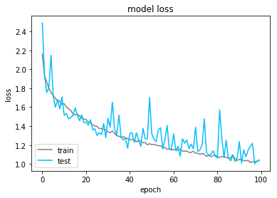

<table>
    <tr>
        <td>
            
        </td>
        <td>
    
        </td>
    </tr>
</table>

# LINCOLN DataScience Challenge #2
### CIFAR-10 - Image Recongnition
---

# Purpose
---
The goal of this notebook is to fit a convolutional network to the dataset CIFAR-10 using the Keras Framework and a Residual Network architecture.

# Documentation
---

+ Deep Residual Learning for Image Recognition https://arxiv.org/pdf/1512.03385.pdf
+ Identity Mappings in Deep Residual Networks https://arxiv.org/pdf/1603.05027.pdf
+ GitHub https://github.com/raghakot/keras-resnet
+ State of art http://rodrigob.github.io/are_we_there_yet/build/classification_datasets_results.html

# Modules
---


```python
from scipy.misc import imread, imsave, imresize, imshow, fromimage
import matplotlib.pyplot as plt
import numpy as np
import time
from sklearn import preprocessing
from convNet import imfunc as imf
```


```python
from keras.utils import np_utils
from keras.models import Model
from keras.layers import Input, merge, Add, LeakyReLU
from keras.layers import Dense, Activation, Flatten, BatchNormalization, Dropout
from keras.layers import Conv2D, MaxPooling2D, ZeroPadding2D, AveragePooling2D
from keras.regularizers import l2
from keras.callbacks import LearningRateScheduler
from keras.optimizers import Adam
from keras.preprocessing.image import ImageDataGenerator

import tensorflow as tf

# Dynamic memory allocation on gpu
config = tf.ConfigProto()
config.gpu_options.allow_growth = True
```

    Using TensorFlow backend.


# Loading images and labels
---

### Images


```python
start_time = time.time()

Xtr = np.zeros((50000,32,32,3), dtype="float32")
for img in range(0,50000):
    Xtr[img] = imread('./CIFAR-10/train/' + str(img+1) + '.png')

print("Loading time: %s seconds" % round(time.time() - start_time))
```

    Loading time: 73 seconds


### Labels


```python
# Training label
Ytr = np.genfromtxt('./CIFAR-10/trainLabels.csv', dtype = 'str', delimiter = ',', skip_header = 1)

# Label dictionnary
label = dict(zip(np.unique(Ytr[:,1]),range(10)))
label_inv = dict(zip(range(10),np.unique(Ytr[:,1])))

# Label list
Ytr = [label[i] for i in Ytr[:,1]]
Ytr_label = [label_inv[i] for i in Ytr]
```

### Plotting some images


```python
# number of image per row
n = 7
idx = np.random.choice(len(Ytr),size=n*3,replace=False)

# Initialization of plots - 2 row and n col
fig, axe = plt.subplots(3,n)

# Assigning image for each subplot
for i in range(n*3):
    axe[i//n,i%n].imshow(Xtr[idx[i]].astype("uint8"))
    axe[i//n,i%n].set_title(Ytr_label[idx[i]])

# Setting figure width and layout
fig.set_figwidth(10)
fig.tight_layout()
plt.show()
```


# Residual Neural Network - Setup
---

### Train / test set


```python
N = 10000

Y = Ytr[:N]
X = Xtr[:N,]

Y_test = Ytr[N:N+1000]
X_test = Xtr[N:N+1000,]
```

### Label recoding


```python
# Recoding
encode = preprocessing.LabelEncoder()
encode.fit(Y)

Y = encode.transform(Y) 
Y_test = encode.transform(Y_test) 

# Creating dummy variable
Y = np_utils.to_categorical(Y, 10)
Y_test= np_utils.to_categorical(Y_test, 10)
```

### Scaling


```python
Xstd = np.std(X,axis = 0)

# Reducing features with non-null std
X[:, Xstd>0] /= Xstd[Xstd>0]
X_test[:, Xstd>0] /= Xstd[Xstd>0]
```

### Residual Network functions
Those functions have been taken from the **Raghakot GitHub** (given in the documentation section) and adapt to Keras V2.


```python
def rnpa_bottleneck_layer(input_tensor, nb_filters, filter_sz, stage,
    init='glorot_normal', reg=0.0, use_shortcuts=True):

    nb_in_filters, nb_bottleneck_filters = nb_filters

    bn_name = 'bn' + str(stage)
    conv_name = 'conv' + str(stage)
    relu_name = 'relu' + str(stage)
    merge_name = '+' + str(stage)

    # batchnorm-relu-conv, from nb_in_filters to nb_bottleneck_filters via 1x1 conv
    if stage>1: # first activation is just after conv1
        x = BatchNormalization(axis=1)(input_tensor)
        x = LeakyReLU(alpha=0.01)(x)
    else:
        x = input_tensor

    x = Conv2D(
            nb_bottleneck_filters, (1, 1),
            kernel_initializer=init,
            kernel_regularizer=l2(reg),
            use_bias=False
        )(x)
    
    # batchnorm-relu-conv, from nb_bottleneck_filters to nb_bottleneck_filters via FxF conv
    x = BatchNormalization(axis=1)(x)
    x = LeakyReLU(alpha=0.01)(x)
    x = Conv2D(
            nb_bottleneck_filters, (filter_sz, filter_sz),
            padding='same',
            kernel_initializer=init,
            kernel_regularizer=l2(reg),
            use_bias = False
        )(x)
   
    # batchnorm-relu-conv, from nb_in_filters to nb_bottleneck_filters via 1x1 conv
    x = BatchNormalization(axis=1)(x)
    x = LeakyReLU(alpha=0.01)(x)
    x = Conv2D(nb_in_filters, (1, 1),
            kernel_initializer=init, kernel_regularizer=l2(reg)
        )(x)

    # merge
    if use_shortcuts:
        x = Add()([x, input_tensor])
    
    return x

def ResNetPreAct(input_shape=(3,32,32), nb_classes=10,
        layer1_params=(5,64,2),
        res_layer_params=(3,16,3),
        final_layer_params=None,
        init='glorot_uniform', reg=0.0, use_shortcuts=True
    ):
    """
    Return a new Residual Network using full pre-activation based on the work in
    "Identity Mappings in Deep Residual Networks"  by He et al
    http://arxiv.org/abs/1603.05027
    The following network definition achieves 92.0% accuracy on CIFAR-10 test using
    `adam` optimizer, 100 epochs, learning rate schedule of 1e.-3 / 1.e-4 / 1.e-5 with
    transitions at 50 and 75 epochs:
    ResNetPreAct(layer1_params=(3,128,2),res_layer_params=(3,32,25),reg=reg)
    
    Removed max pooling and using just stride in first convolutional layer. Motivated by
    "Striving for Simplicity: The All Convolutional Net"  by Springenberg et al
    (https://arxiv.org/abs/1412.6806) and my own experiments where I observed about 0.5%
    improvement by replacing the max pool operations in the VGG-like cifar10_cnn.py example
    in the Keras distribution.
    
    Parameters
    ----------
    input_dim : tuple of (C, H, W)
    nb_classes: number of scores to produce from final affine layer (input to softmax)
    layer1_params: tuple of (filter size, num filters, stride for conv)
    res_layer_params: tuple of (filter size, num res layer filters, num res stages)
    final_layer_params: None or tuple of (filter size, num filters, stride for conv)
    init: type of weight initialization to use
    reg: L2 weight regularization (or weight decay)
    use_shortcuts: to evaluate difference between residual and non-residual network
    """
    sz_L1_filters, nb_L1_filters, stride_L1 = layer1_params
    sz_res_filters, nb_res_filters, nb_res_stages = res_layer_params
    
    use_final_conv = (final_layer_params is not None)
    if use_final_conv:
        sz_fin_filters, nb_fin_filters, stride_fin = final_layer_params
        sz_pool_fin = input_shape[1] / (stride_L1 * stride_fin)
    else:
        sz_pool_fin = input_shape[1] / (stride_L1)

    img_input = Input(shape=input_shape,name='cifar')
   
    x = Conv2D(
            nb_L1_filters, (sz_L1_filters, sz_L1_filters),
            padding='same',
            strides=(stride_L1, stride_L1),
            kernel_initializer=init,
            kernel_regularizer=l2(reg),
            use_bias=False
        )(img_input)
    x = BatchNormalization(axis=1)(x)
    x = LeakyReLU(alpha=0.01)(x)
    
    for stage in range(1,nb_res_stages+1):
        x = rnpa_bottleneck_layer(
                x,
                (nb_L1_filters, nb_res_filters),
                sz_res_filters, 
                stage,
                init=init, 
                reg=reg, 
                use_shortcuts=use_shortcuts
            )
        
    x = BatchNormalization(axis=1)(x)
    x = LeakyReLU(alpha=0.01)(x)

    if use_final_conv:
        x = Conv2D(
                nb_fin_filters, (sz_fin_filters, sz_fin_filters),
                padding='same',
                strides=(stride_fin, stride_fin),
                kernel_initializer=init,
                kernel_regularizer=l2(reg)
            )(x)

    x = AveragePooling2D((2,2))(x)
    x=Dropout(0.2)(x)
    x = Flatten()(x)
    x = Dense(nb_classes, activation='softmax')(x)
    return Model(img_input, x)

```

### Initialization / Compilation of model


```python
model=ResNetPreAct(input_shape=(32,32,3), nb_classes=10,
        layer1_params=(5,32,2),
        res_layer_params=(5,16,10),
        final_layer_params=None,
        init='glorot_uniform', reg=0.0, use_shortcuts=True
    )

model.compile(loss='categorical_crossentropy', optimizer=Adam(lr=0.001),metrics=['accuracy'])
```

### Learning rate decay function


```python
def step_decay(epoch):
    if epoch >= 75:
        lrate = 0.00001
    elif epoch >= 50:
        lrate = 0.0001
    else :
        lrate = 0.001
    return lrate
lrate = LearningRateScheduler(step_decay)
callbacks_list = [lrate]
```

### Data augmentation


```python
datagen = ImageDataGenerator(
    rotation_range = 20,
    width_shift_range=0.3,
    height_shift_range=0.3,
    horizontal_flip=True
)
datagen.fit(X)

```

# Residual Neural Network - Training
---

### With data augmentation


```python
start_time = time.time()
history=model.fit_generator(datagen.flow(X, 
                                         Y,
                                         batch_size=128),   
                            validation_data=(X_test,Y_test),
                            #callbacks=callbacks_list,
                            steps_per_epoch=len(X) / 128,
                            epochs=100,
                            verbose=2)
end_time = time.time()
```

    Epoch 1/100
    9s - loss: 1.0120 - acc: 0.6409 - val_loss: 1.0457 - val_acc: 0.6550
    Epoch 2/100


### Without data augmentation


```python
start_time = time.time()
history=model.fit(X, Y, 
                  batch_size=128,
                  epochs=100, 
                  validation_split=0.2,
                  callbacks=callbacks_list,
                  verbose=1)
end_time = time.time()
```

    Train on 32000 samples, validate on 8000 samples
    Epoch 1/100
      640/32000 [..............................] - ETA: 129s - loss: 2.8994 - acc: 0.1250


    ---------------------------------------------------------------------------

    KeyboardInterrupt                         Traceback (most recent call last)

    <ipython-input-23-9efbf421953f> in <module>()
          5                   validation_split=0.2,
          6                   callbacks=callbacks_list,
    ----> 7                   verbose=1)
          8 end_time = time.time()


    c:\programdata\anaconda3\lib\site-packages\keras\engine\training.py in fit(self, x, y, batch_size, epochs, verbose, callbacks, validation_split, validation_data, shuffle, class_weight, sample_weight, initial_epoch, steps_per_epoch, validation_steps, **kwargs)
       1596                               initial_epoch=initial_epoch,
       1597                               steps_per_epoch=steps_per_epoch,
    -> 1598                               validation_steps=validation_steps)
       1599 
       1600     def evaluate(self, x, y,


    c:\programdata\anaconda3\lib\site-packages\keras\engine\training.py in _fit_loop(self, f, ins, out_labels, batch_size, epochs, verbose, callbacks, val_f, val_ins, shuffle, callback_metrics, initial_epoch, steps_per_epoch, validation_steps)
       1181                     batch_logs['size'] = len(batch_ids)
       1182                     callbacks.on_batch_begin(batch_index, batch_logs)
    -> 1183                     outs = f(ins_batch)
       1184                     if not isinstance(outs, list):
       1185                         outs = [outs]


    c:\programdata\anaconda3\lib\site-packages\keras\backend\tensorflow_backend.py in __call__(self, inputs)
       2271         updated = session.run(self.outputs + [self.updates_op],
       2272                               feed_dict=feed_dict,
    -> 2273                               **self.session_kwargs)
       2274         return updated[:len(self.outputs)]
       2275 


    c:\programdata\anaconda3\lib\site-packages\tensorflow\python\client\session.py in run(self, fetches, feed_dict, options, run_metadata)
        887     try:
        888       result = self._run(None, fetches, feed_dict, options_ptr,
    --> 889                          run_metadata_ptr)
        890       if run_metadata:
        891         proto_data = tf_session.TF_GetBuffer(run_metadata_ptr)


    c:\programdata\anaconda3\lib\site-packages\tensorflow\python\client\session.py in _run(self, handle, fetches, feed_dict, options, run_metadata)
       1118     if final_fetches or final_targets or (handle and feed_dict_tensor):
       1119       results = self._do_run(handle, final_targets, final_fetches,
    -> 1120                              feed_dict_tensor, options, run_metadata)
       1121     else:
       1122       results = []


    c:\programdata\anaconda3\lib\site-packages\tensorflow\python\client\session.py in _do_run(self, handle, target_list, fetch_list, feed_dict, options, run_metadata)
       1315     if handle is None:
       1316       return self._do_call(_run_fn, self._session, feeds, fetches, targets,
    -> 1317                            options, run_metadata)
       1318     else:
       1319       return self._do_call(_prun_fn, self._session, handle, feeds, fetches)


    c:\programdata\anaconda3\lib\site-packages\tensorflow\python\client\session.py in _do_call(self, fn, *args)
       1321   def _do_call(self, fn, *args):
       1322     try:
    -> 1323       return fn(*args)
       1324     except errors.OpError as e:
       1325       message = compat.as_text(e.message)


    c:\programdata\anaconda3\lib\site-packages\tensorflow\python\client\session.py in _run_fn(session, feed_dict, fetch_list, target_list, options, run_metadata)
       1300           return tf_session.TF_Run(session, options,
       1301                                    feed_dict, fetch_list, target_list,
    -> 1302                                    status, run_metadata)
       1303 
       1304     def _prun_fn(session, handle, feed_dict, fetch_list):


    KeyboardInterrupt: 


### Processing time


```python
print('Processing time : %.2f heures' % ((end_time - start_time)/3600))
```

    Processing time : 6.93 heures


# Residual Neural Network - Results
---

### Accuracy / Score


```python
score = model.evaluate(X_test, Y_test,
batch_size=1000, verbose=2)

print("Test score: %.2f" % (score[0]))
print('Test accuracy: %.2f' % (score[1] * 100))
```

    Test score: 1.04
    Test accuracy: 65.30


### Plotting training process


```python
plt.plot(history.history['acc'],c="grey")
plt.plot(history.history['val_acc'],c="deepskyblue")
plt.title('model accuracy')
plt.ylabel('accuracy')
plt.xlabel('epoch')
plt.legend(['train', 'test'], loc='upper left')
plt.show()
```


```python
plt.plot(history.history['loss'],c="grey")
plt.plot(history.history['val_loss'],c="deepskyblue")
plt.title('model loss')
plt.ylabel('loss')
plt.xlabel('epoch')
plt.legend(['train', 'test'], loc='lower left')
plt.show()
```




